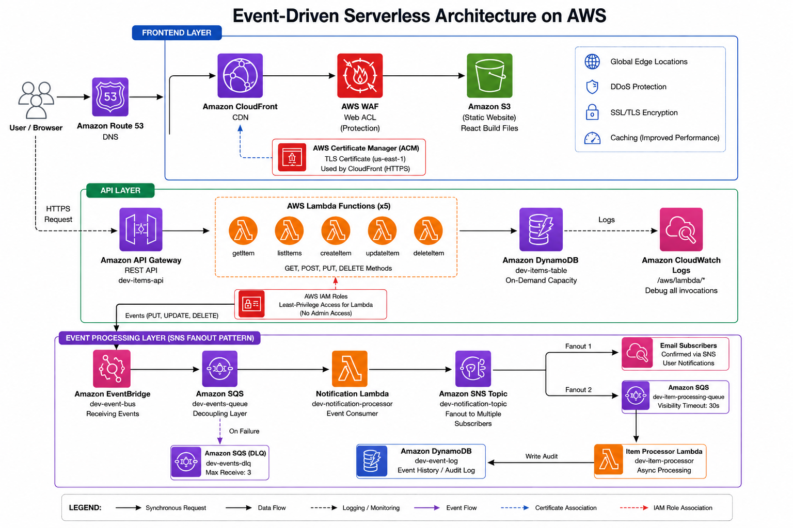
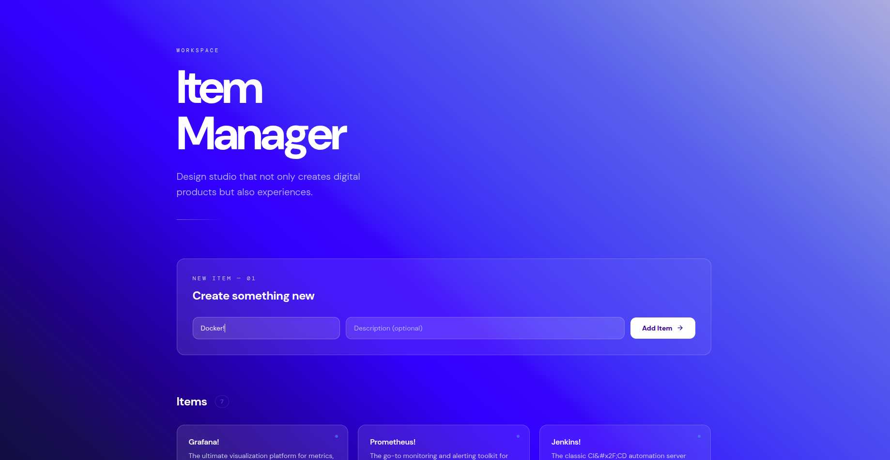

# ServerlessCore

A production-grade, event-driven serverless CRUD application built on AWS. Features WAF protection, custom domains, SNS fan-out event processing, and a complete CI/CD pipeline managed with Terraform.

**Live endpoints:**

| Surface  | URL                                   |
| -------- | ------------------------------------- |
| Frontend | https://cloudforsushant.xyz           |
| API      | https://api.cloudforsushant.xyz/items |

---



## Architecture

```
CI/CD PIPELINE
  GitHub Actions --> Terraform Apply

FRONTEND LAYER
  Route 53 --> CloudFront (WAF + ACM) --> S3 (React + Vite)
  cloudforsushant.xyz

API LAYER
  Route 53 --> API Gateway --> Lambda (7 functions) --> DynamoDB
  api.cloudforsushant.xyz                           --> CloudWatch

EVENT PROCESSING LAYER
  Lambda --> EventBridge --> SQS --> Notification Lambda --> SNS Topic
               |                         |                    |-- Email Subscribers
               |                         |                    |-- SQS (item-processing-queue)
               |                    On failure                        |
               |                    SQS (DLQ)               Item Processor Lambda
               |                                                      |
               +------------------------------------------------------+
                                                             DynamoDB (audit-log)
SECURITY LAYER
  WAF (OWASP managed rules + rate limiting)
  CloudFront OAC (private S3, no public access)
  IAM least-privilege roles (per-function)
  XSS input sanitization at Lambda layer
```

---

## AWS Services (15)

| Service        | Role                                                   |
| -------------- | ------------------------------------------------------ |
| Lambda         | Serverless compute — 7 functions                       |
| API Gateway    | HTTP API with custom domain                            |
| DynamoDB       | NoSQL storage — items table + audit-log table          |
| EventBridge    | Custom event bus for decoupled event routing           |
| SQS            | Message queuing — 3 queues including DLQ               |
| SNS            | Email notifications and fan-out to subscribers         |
| S3             | Private static frontend hosting                        |
| CloudFront     | Global CDN with HTTPS termination                      |
| Route 53       | DNS management for both domains                        |
| ACM            | TLS certificate provisioned in us-east-1               |
| WAF            | Web Application Firewall — OWASP rules + rate limiting |
| IAM            | Least-privilege execution roles per Lambda function    |
| CloudWatch     | Centralized logs and invocation monitoring             |
| CloudFront OAC | Origin Access Control for private S3 access            |

---

## Prerequisites

- AWS CLI configured with appropriate credentials
- Terraform >= 1.5.0
- Node.js >= 22
- Git
- AWS account with a registered Route 53 domain
- ACM certificate provisioned in `us-east-1`

---

## Deployment

### 1. Clone the repository

```bash
git clone https://github.com/cloudforsushant/ServerlessCore.git
cd ServerlessCore
```

### 2. Configure environment variables

```bash
vim environments/dev/terraform.tfvars
```

```hcl
environment         = "dev"
domain_name         = "yourdomain.xyz"
api_domain_name     = "api.yourdomain.xyz"
email_endpoint      = "your-email@gmail.com"
acm_certificate_arn = "arn:aws:acm:us-east-1:YOUR_ACCOUNT:certificate/YOUR_CERT_ID"
zone_id             = "YOUR_ROUTE53_ZONE_ID"
```

### 3. Deploy infrastructure

```bash
cd environments/dev

terraform init
terraform plan  -var-file="terraform.tfvars"
terraform apply -var-file="terraform.tfvars"
```




### 4. Build and deploy frontend

```bash
cd ../../frontend

npm install

echo "VITE_API_URL=https://api.yourdomain.xyz" > .env
npm run build

cd ../environments/dev
BUCKET=$(terraform output -raw frontend_bucket_name)
CF_ID=$(terraform output -raw cloudfront_id)

cd ../../frontend
aws s3 sync dist/ "s3://${BUCKET}" --delete

aws cloudfront create-invalidation \
  --distribution-id "$CF_ID" \
  --paths "/*"
```

---

## API Reference

Base URL: `https://api.cloudforsushant.xyz`

| Method | Path        | Description       |
| ------ | ----------- | ----------------- |
| GET    | /items      | List all items    |
| POST   | /items      | Create an item    |
| GET    | /items/{id} | Get a single item |
| PUT    | /items/{id} | Update an item    |
| DELETE | /items/{id} | Delete an item    |

### Example requests

```bash
API="https://api.cloudforsushant.xyz"

# List items
curl "$API/items"

# Create an item
curl -X POST "$API/items" \
  -H "Content-Type: application/json" \
  -d '{"name":"My Item","description":"A test item"}'

# Get a single item
curl "$API/items/ITEM_ID"

# Update an item
curl -X PUT "$API/items/ITEM_ID" \
  -H "Content-Type: application/json" \
  -d '{"name":"Updated Name"}'

# Delete an item
curl -X DELETE "$API/items/ITEM_ID"
```

---

## Event Flow Verification

Creating an item triggers the full event chain: EventBridge -> SQS -> Notification Lambda -> SNS (email + fan-out) -> Item Processor Lambda -> DynamoDB audit-log.

```bash
# 1. Trigger the chain
curl -X POST https://api.cloudforsushant.xyz/items \
  -H "Content-Type: application/json" \
  -d '{"name":"Event Test","description":"Testing event chain"}'

# 2. Confirm email notification received

# 3. Verify audit log entry
aws dynamodb scan --table-name dev-audit-log --max-items 5

# 4. Inspect Lambda logs
aws logs tail /aws/lambda/dev-create-item             --since 5m
aws logs tail /aws/lambda/dev-notification-processor  --since 5m
aws logs tail /aws/lambda/dev-item-processor          --since 5m
```

---

## Security Testing

### WAF stress test

The following script tests rate limiting, SQL injection blocking, and XSS blocking in parallel. No emojis, no fluff — just results.

```bash
#!/bin/bash

RESULTS_FILE="/tmp/waf-test-results.txt"
> "$RESULTS_FILE"

echo "================================================================"
echo "  WAF STRESS TEST"
echo "  Target: https://api.cloudforsushant.xyz"
echo "================================================================"

# --- Rate Limit ---
echo ""
echo "[1/3] Rate limit test  (300 concurrent requests)..."
for i in $(seq 1 300); do
  curl -s -o /dev/null -w "%{http_code}\n" \
    https://api.cloudforsushant.xyz/items >> "$RESULTS_FILE" &
done
wait

# --- SQL Injection ---
echo "[2/3] SQL injection test  (50 concurrent requests)..."
for i in $(seq 1 50); do
  curl -s -o /dev/null -w "%{http_code}\n" \
    "https://api.cloudforsushant.xyz/items?id=1'+OR+'1'='1" >> "$RESULTS_FILE" &
done
wait

# --- XSS ---
echo "[3/3] XSS test  (50 concurrent requests)..."
for i in $(seq 1 50); do
  curl -s -o /dev/null -w "%{http_code}\n" \
    -X POST https://api.cloudforsushant.xyz/items \
    -H "Content-Type: application/json" \
    -d '{"name":"<script>alert(1)</script>"}' >> "$RESULTS_FILE" &
done
wait

# --- Results ---
TOTAL=$(wc -l < "$RESULTS_FILE")
ALLOWED=$(grep -c '200' "$RESULTS_FILE")
BLOCKED=$(grep -c '403' "$RESULTS_FILE")
BLOCK_RATE=$(echo "scale=2; $BLOCKED * 100 / $TOTAL" | bc)

echo ""
echo "================================================================"
echo "  RESULTS"
echo "================================================================"
echo "  Total requests : $TOTAL"
echo "  200 Allowed    : $ALLOWED"
echo "  403 Blocked    : $BLOCKED"
echo "  Block rate     : ${BLOCK_RATE}%"
echo "================================================================"
```

### View WAF logs

```bash
aws logs tail "aws-waf-logs-dev" --since 1h | grep BLOCK
```

---

## Monitoring

```bash
# Lambda logs
aws logs tail /aws/lambda/dev-get-items              --since 10m
aws logs tail /aws/lambda/dev-create-item            --since 10m
aws logs tail /aws/lambda/dev-notification-processor --since 10m

# SQS queue state
aws sqs get-queue-attributes \
  --queue-url "https://sqs.us-east-1.amazonaws.com/YOUR_ACCOUNT_ID/dev-events-queue" \
  --attribute-names All

# DynamoDB tables
aws dynamodb scan --table-name dev-items-table
aws dynamodb scan --table-name dev-audit-log

# SNS subscriptions
aws sns list-subscriptions-by-topic \
  --topic-arn "arn:aws:sns:us-east-1:YOUR_ACCOUNT_ID:dev-notification-topic"

# Lambda event source mappings
aws lambda list-event-source-mappings \
  --function-name dev-notification-processor
```

---

## Terraform Reference

```bash
cd environments/dev

terraform init
terraform validate
terraform plan    -var-file="terraform.tfvars"
terraform apply   -var-file="terraform.tfvars"
terraform output
terraform state list
terraform destroy -var-file="terraform.tfvars"   # destructive
```

---

## CI/CD Pipeline

Three GitHub Actions workflows are configured:

| Trigger              | Workflow             | Action                                                |
| -------------------- | -------------------- | ----------------------------------------------------- |
| Pull request         | `terraform-plan.yml` | Runs `terraform plan` and posts diff as PR comment    |
| Merge to main        | `deploy.yml`         | Runs `terraform apply` to deploy infrastructure       |
| Frontend file change | `deploy.yml`         | Builds React app, syncs to S3, invalidates CloudFront |

```bash
# Trigger manually
gh workflow run "Terraform Apply"
gh workflow run "Deploy Frontend"

# Monitor runs
gh run list --limit 10
gh run watch <RUN_ID>
```

---

## Project Structure

```
ServerlessCore/
├── .github/
│   └── workflows/
│       ├── deploy.yml
│       └── terraform-plan.yml
├── environments/
│   ├── dev/
│   │   ├── main.tf
│   │   ├── variables.tf
│   │   ├── terraform.tfvars
│   │   └── outputs.tf
│   └── prod/                     # Planned
├── modules/
│   ├── api-gateway/
│   ├── dynamodb/
│   ├── eventbridge/
│   ├── frontend-hosting/
│   ├── iam/
│   ├── lambda/
│   ├── sns/
│   ├── sqs/
│   └── waf/
├── lambda-code/
│   ├── create-item/
│   ├── delete-item/
│   ├── get-item/
│   ├── get-items/
│   ├── item-processor/
│   ├── notification-processor/
│   └── update-item/
├── frontend/
│   ├── src/
│   ├── public/
│   └── dist/
└── scripts/
```

---

## Security Features

| Control              | Implementation                                   |
| -------------------- | ------------------------------------------------ |
| Transport security   | CloudFront + ACM — HTTPS only                    |
| XSS prevention       | Lambda input sanitization + WAF managed rules    |
| SQL injection        | WAF OWASP managed rule group                     |
| DDoS / rate limiting | WAF rate limit — 2000 requests per 5 minutes     |
| Least privilege      | 7 IAM roles, one per Lambda function             |
| Private storage      | S3 with CloudFront OAC — no public bucket access |
| Message reliability  | Dead-letter queue with 3 retry attempts          |
| Input validation     | Sanitization layer inside each Lambda handler    |
| Log hygiene          | WAF request headers redacted in logs             |

---

## Cost Estimate

| Service     | Monthly estimate          |
| ----------- | ------------------------- |
| Lambda      | Free tier (1M requests)   |
| API Gateway | Free tier (1M requests)   |
| DynamoDB    | Free tier (25 GB)         |
| CloudFront  | Free tier (1 TB transfer) |
| S3          | ~$0.01                    |
| SQS         | Free tier (1M requests)   |
| SNS         | Free tier (1M publishes)  |
| WAF         | ~$8.00                    |
| Route 53    | $0.50                     |
| **Total**   | **~$9/month**             |

---

## Troubleshooting

**Email notifications not arriving**

```bash
# Check subscription status
aws sns list-subscriptions-by-topic --topic-arn "YOUR_SNS_ARN"
# If status is PendingConfirmation, check spam folder for the AWS confirmation email
```

**Lambda not processing SQS messages**

```bash
# Check event source mapping status
aws lambda list-event-source-mappings --function-name dev-notification-processor

# Re-enable if disabled
aws lambda update-event-source-mapping --uuid UUID --enabled
```

**Messages accumulating in SQS**

```bash
# Inspect queue attributes
aws sqs get-queue-attributes \
  --queue-url "QUEUE_URL" \
  --attribute-names All

# Read from DLQ
aws sqs receive-message \
  --queue-url "DLQ_URL" \
  --max-number-of-messages 10
```

---

## License

MIT License. Free to use, fork, and adapt.
