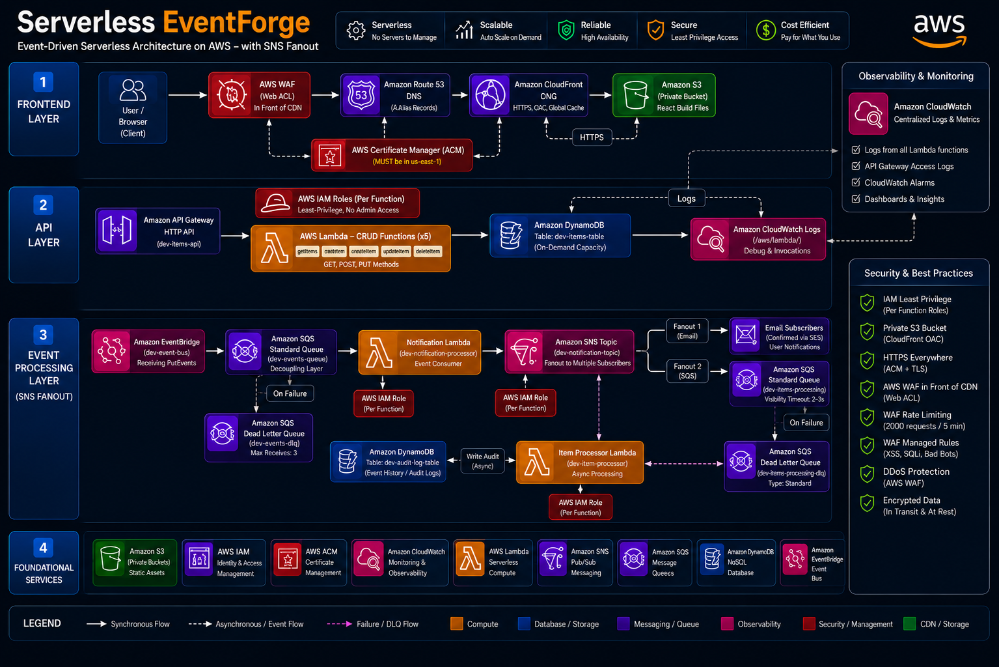

# 🚀 ServerlessCore - Full-Stack Serverless Application


A production-grade, event-driven serverless CRUD application with WAF protection, custom domains, and complete CI/CD pipeline.

## 🏗️ Architecture



## 🌐 Live Demo

| Endpoint     | URL                                                                            |
| ------------ | ------------------------------------------------------------------------------ |
| **Frontend** | [https://cloudforsushant.xyz](https://cloudforsushant.xyz)                     |
| **API**      | [https://api.cloudforsushant.xyz/items](https://api.cloudforsushant.xyz/items) |

---

## 🏗️ Architecture

┌─────────────────────────────────────────────────────────────┐
│ CI/CD PIPELINE │
│ GitHub Actions → Terraform │
└─────────────────────────────────────────────────────────────┘
↓
┌─────────────────────────────────────────────────────────────┐
│ FRONTEND LAYER │
│ Route53 → CloudFront → S3 (React + Vite) │
│ cloudforsushant.xyz │
└─────────────────────────────────────────────────────────────┘
↓
┌─────────────────────────────────────────────────────────────┐
│ API LAYER │
│ Route53 → API Gateway → Lambda (7 functions) │
│ api.cloudforsushant.xyz │
└─────────────────────────────────────────────────────────────┘
↓
┌─────────────────────────────────────────────────────────────┐
│ DATA & EVENT LAYER │
│ DynamoDB ← Lambda → EventBridge → SQS → Lambda → SNS │
│ ↓ │
│ Email + SQS (fan-out) │
└─────────────────────────────────────────────────────────────┘
↓
┌─────────────────────────────────────────────────────────────┐
│ SECURITY LAYER │
│ WAF → CloudFront → OAC → Private S3 │
│ IAM (Least Privilege) → XSS Sanitization │
└─────────────────────────────────────────────────────────────┘

text

---

## 📊 AWS Services Used (15)

| Service            | Purpose                          |
| ------------------ | -------------------------------- |
| **Lambda**         | Serverless compute (7 functions) |
| **API Gateway**    | HTTP API with custom domain      |
| **DynamoDB**       | NoSQL database (2 tables)        |
| **EventBridge**    | Custom event bus                 |
| **SQS**            | Message queuing (3 queues)       |
| **SNS**            | Email notifications + fan-out    |
| **S3**             | Frontend hosting (private)       |
| **CloudFront**     | Global CDN with HTTPS            |
| **Route 53**       | DNS management                   |
| **ACM**            | SSL/TLS certificate              |
| **WAF**            | Web Application Firewall         |
| **IAM**            | Least-privilege roles            |
| **CloudWatch**     | Logs & monitoring                |
| **CloudFront OAC** | Secure S3 access                 |

---

## 🚀 Quick Start

### Prerequisites

````bash
# Required tools
- AWS CLI (configured)
- Terraform >= 1.5.0
- Node.js >= 22
- Git
- AWS Account with Route53 domain
- ACM certificate in us-east-1
1. Clone & Setup
bash
git clone https://github.com/cloudforsushant/ServerlessCore.git
cd ServerlessCore
2. Configure Environment
bash
# Edit your environment file
vim environments/dev/terraform.tfvars
hcl
environment = "dev"
domain_name     = "yourdomain.xyz"
api_domain_name = "api.yourdomain.xyz"
email_endpoint  = "your-email@gmail.com"
acm_certificate_arn = "arn:aws:acm:us-east-1:YOUR_ACCOUNT:certificate/YOUR_CERT_ID"
zone_id = "YOUR_ROUTE53_ZONE_ID"
3. Deploy Infrastructure
bash
cd environments/dev

# Initialize Terraform
terraform init

# Plan changes
terraform plan -var-file="terraform.tfvars"

# Deploy
terraform apply -var-file="terraform.tfvars"
4. Deploy Frontend
bash
cd ../../frontend

# Install dependencies
npm install

# Build with API URL
echo "VITE_API_URL=https://api.yourdomain.xyz" > .env
npm run build

# Get S3 bucket name
cd ../environments/dev
BUCKET=$(terraform output -raw frontend_bucket_name)
CF_ID=$(terraform output -raw cloudfront_id)

# Upload to S3
cd ../../frontend
aws s3 sync dist/ "s3://${BUCKET}" --delete

# Invalidate CloudFront
aws cloudfront create-invalidation \
  --distribution-id "$CF_ID" \
  --paths "/*"

echo "✅ Deployed: https://yourdomain.xyz"
📡 API Endpoints
Test Commands
bash
API="https://api.cloudforsushant.xyz"

# List all items
curl $API/items

# Create an item
curl -X POST $API/items \
  -H "Content-Type: application/json" \
  -d '{"name":"My Item","description":"A test item"}'

# Get single item
curl $API/items/ITEM_ID

# Update an item
curl -X PUT $API/items/ITEM_ID \
  -H "Content-Type: application/json" \
  -d '{"name":"Updated Name"}'

# Delete an item
curl -X DELETE $API/items/ITEM_ID
🔄 Event Flow Testing
bash
# 1. Create item (triggers full event chain)
curl -X POST https://api.cloudforsushant.xyz/items \
  -H "Content-Type: application/json" \
  -d '{"name":"Event Test","description":"Testing events"}'

# 2. Check email for notification
# 3. Check DynamoDB audit table
aws dynamodb scan --table-name dev-audit-log --max-items 5

# 4. Check Lambda logs
aws logs tail /aws/lambda/dev-create-item --since 5m
aws logs tail /aws/lambda/dev-notification-processor --since 5m
aws logs tail /aws/lambda/dev-item-processor --since 5m
🛡️ Security Testing
WAF Protection
bash
# Test XSS (sanitized by Lambda, blocked by WAF)
curl -X POST https://api.cloudforsushant.xyz/items \
  -H "Content-Type: application/json" \
  -d '{"name":"<script>alert(1)</script>"}'

# Test SQL Injection (blocked by WAF)
curl "https://api.cloudforsushant.xyz/items?id=1'+OR+'1'='1"

# Test Rate Limiting
for i in $(seq 1 500); do
  curl -s -o /dev/null -w "%{http_code}\n" https://cloudforsushant.xyz &
done

# View WAF Logs
aws logs tail "aws-waf-logs-dev" --since 1h | grep BLOCK
📊 Monitoring & Debugging
bash
# View all Lambda logs
aws logs tail /aws/lambda/dev-get-items --since 10m
aws logs tail /aws/lambda/dev-create-item --since 10m
aws logs tail /aws/lambda/dev-notification-processor --since 10m

# Check SQS queues
aws sqs get-queue-attributes \
  --queue-url "https://sqs.us-east-1.amazonaws.com/YOUR-ACCOUNT-ID/dev-events-queue" \
  --attribute-names All

# Check DynamoDB
aws dynamodb scan --table-name dev-items-table
aws dynamodb scan --table-name dev-audit-log

# Check SNS subscriptions
aws sns list-subscriptions-by-topic \
  --topic-arn "arn:aws:sns:us-east-1:YOUR-ACCOUNT-ID:dev-notification-topic"

# Check Lambda triggers
aws lambda list-event-source-mappings --function-name dev-notification-processor
🏗️ Terraform Commands
bash
# Navigate to environment
cd environments/dev

# Initialize
terraform init

# Validate
terraform validate

# Plan
terraform plan -var-file="terraform.tfvars"

# Apply
terraform apply -var-file="terraform.tfvars"

# Show outputs
terraform output

# Show state
terraform state list

# Destroy (caution!)
terraform destroy -var-file="terraform.tfvars"
🔄 CI/CD Pipeline
GitHub Actions Workflows
bash
# On PR: Terraform Plan (shows changes)
# On Merge to main: Terraform Apply (deploys infra)
# On Frontend changes: Build → S3 Upload → CloudFront Invalidate

# Manual trigger
gh workflow run "Terraform Apply"
gh workflow run "Deploy Frontend"

# View runs
gh run list --limit 10

# Watch run
gh run watch <RUN_ID>
📁 Project Structure
text
ServerlessCore/
├── .github/workflows/
│   ├── terraform-plan.yml       # PR checks
│   ├── terraform-apply.yml      # Deploy on merge
│   ├── environments/
│   ├── dev/                     # Development
│   │   ├── main.tf
│   │   ├── variables.tf
│   │   ├── terraform.tfvars
│   │   └── outputs.tf
│   └── prod/                    # Production (future)
├── modules/
│   ├── dynamodb/                # Database
│   ├── iam/                     # Permissions
│   ├── lambda/                  # Compute
│   ├── api-gateway/             # API
│   ├── eventbridge/             # Events
│   ├── sqs/                     # Queues
│   ├── sns/                     # Notifications
│   ├── frontend-hosting/        # CDN + S3
│   └── waf/                     # Firewall
├── lambda-code/                 # Function code
│   ├── get-items/
│   ├── get-item/
│   ├── create-item/
│   ├── update-item/
│   ├── delete-item/
│   ├── notification-processor/
│   └── item-processor/
├── frontend/                    # React app
│   ├── src/
│   ├── public/
│   └── dist/
└── scripts/                     # Utility scripts
🔐 Security Features
Feature	Implementation
HTTPS Only	CloudFront + ACM
XSS Protection	Lambda sanitization + WAF
SQL Injection	WAF managed rules
DDoS Protection	WAF rate limiting (2000/5min)
Least Privilege	7 IAM roles, per-function permissions
Private Storage	S3 with OAC, no public access
Message Reliability	DLQ with 3 retries
Input Validation	Lambda sanitization layer
Log Redaction	WAF headers redacted
💰 Cost Estimate
Service	Monthly Cost
Lambda	Free tier (1M requests)
API Gateway	Free tier (1M requests)
DynamoDB	Free tier (25GB)
CloudFront	Free tier (1TB)
S3	~$0.01
SQS	Free tier (1M requests)
SNS	Free tier (1M publishes)
WAF	~$8/month
Route 53	$0.50/month
Total	~$9/month
🛠️ Troubleshooting
Email not receiving
bash
# Check SNS subscription
aws sns list-subscriptions-by-topic --topic-arn "YOUR_SNS_ARN"

# Check if subscription is confirmed
# If PendingConfirmation, check spam folder
Lambda not triggering
bash
# Check event source mapping
aws lambda list-event-source-mappings --function-name dev-notification-processor

# Enable if disabled
aws lambda update-event-source-mapping --uuid UUID --enabled
SQS messages stuck
bash
# Check queue attributes
aws sqs get-queue-attributes --queue-url "QUEUE_URL" --attribute-names All

# Check DLQ
aws sqs receive-message --queue-url "DLQ_URL" --max-number-of-messages 10
🎯 Features
✅ Full CRUD operations

✅ Custom domains with HTTPS

✅ Event-driven architecture

✅ Email notifications on all actions

✅ Audit logging in DynamoDB

✅ WAF protection (OWASP Top 10)

✅ XSS sanitization

✅ Rate limiting

✅ Dead letter queues

✅ Infrastructure as Code

✅ CI/CD with GitHub Actions

✅ Multi-environment ready

✅ Private S3 with OAC

✅ CloudFront CDN

✅ SNS fan-out pattern

✅ Least privilege IAM

📝 License
MIT License - Feel free to use this for your own projects!

🙏 Acknowledgments
Built with ❤️ using AWS serverless services and Terraform.

⭐ If you like this project, give it a star on GitHub!

